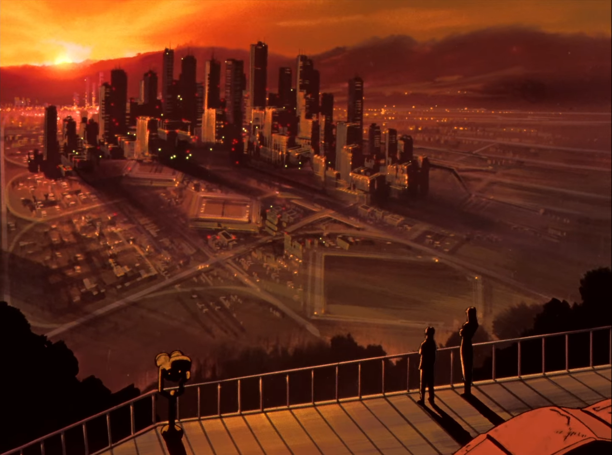
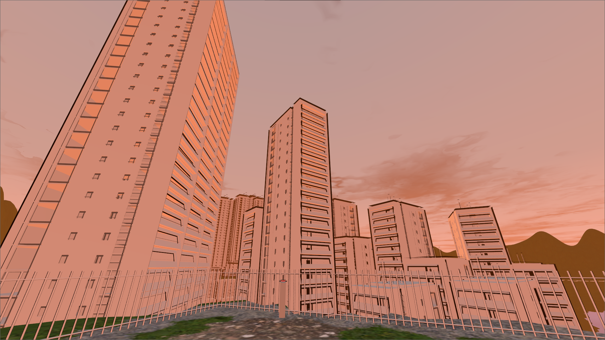

# Project Title

Name: Tokyo-3

Student Number: C20394933 & C20381946

Class Group: TU856/4

Video: 

[](https://www.youtube.com/watch?v=J2kHSSFA4NU)

# Description of the project
In the hit anime Evangelion, there is a futiristic city shown which sinks into the ground when in danger. This type of futurism is intriguing and we sought to recreate the environment and vibe for our project. We want players to truly experience how  this life could be. https://www.reddit.com/r/NeonGenesisEvangelion/comments/q7erof/this_is_tokyo3_this_is_our_city_and_its_the_city/ here attached

# Instructions for use
WASD <- Movement keys
SPACE / MOUSEWHEEL UP + DOWN <- Jump
E <- Interact
C <- Save point
V <- Reload to save point
ESC <- quit

# Bunny hopping, or "bhopping"
This a technique used to increase speed and maneuverability.
It involves a sequence of jumps, performed at the point of contact with the ground, to prevent a speed penalty, paired with the player's movement and turning

Here's a basic overview of how to bhop:

1. Start Running: Begin by running forward in the game.
2. Jump: As you start moving, jump.
3. Mid-Air Movement: While in the air, slightly turn your character in the direction you want to go and strafe (move sideways) in that direction. For example, if you turn right, strafe right.
4. Timing the Jumps: As soon as you land, jump again and repeat the process – turn and strafe in the same or opposite direction.
5. Rhythm and Momentum: The key to successful bhopping is maintaining a rhythm. Each jump and strafe should be smooth and timed to maintain or build speed. ( for this project "autohop" is enabled and so therefore rhythm is not as important)

# How it works
Game has a simple interactable button which causes the building animation to begin. The remainder of the game is a clone of the "bhop" mechanic from Quake / Source engine games.
The button emits a signal which begins the animation. The player movement is then utilized to complete the platforming aspect of the game.
# List of classes/assets in the project

| Class/asset | Source |
|-----------|-----------|
| player.gd | Self written - inspired by research done on [this paper](https://www.theseus.fi/bitstream/handle/10024/507593/Peltola_Mikko.pdf?sequence=2&isAllowed=y#:~:text=In%20it's%20most%20common%20form,into%20the%20held%20strafe%20direction.) in Unity |
| Interactable.gd | Self written |
| ButtonPress.gd | Self written |
| FrontTowerRise.gd | Self written |
| FrontTowerRise.gd | Modified from [this video](https://www.youtube.com/watch?v=7L6ZUYj1hs8)
| outline2.gdshader | Modified from [this article](https://godotshaders.com/shader/complete-cel-shader-for-godot-4/) |
| cel-shader-base.gdshader | From [this article](https://godotshaders.com/shader/complete-cel-shader-for-godot-4/) |
| HTerrain.gd | Incredible plugin from [this repo](https://github.com/Zylann/godot_heightmap_plugin) |

# References
* https://www.theseus.fi/bitstream/handle/10024/507593/Peltola_Mikko.pdf?sequence=2&isAllowed=y#:~:text=In%20it's%20most%20common%20form,into%20the%20held%20strafe%20direction.
* https://www.youtube.com/watch?v=7L6ZUYj1hs8
* https://github.com/Zylann/godot_heightmap_plugin


# What I am most proud of in the assignment
Aidan:
Learned many new techniques in 3D modelling and how to do basic animation in Godot.


# What I learned
Aidan
Learned many features of the godot engine.
3D modelling techniqes and animation.
How to write movement code.
How to utilize signals to run events.
Working with audio and particle systems in Godot.
Level design principles and info regarding normals and mesh optimization (reducing draw calls by combining models)
# Proposal submitted earlier can go here:
In the hit anime Evangelion, there is a futiristic city shown which sinks into the ground when in danger. This type of futurism is intriguing and we sought to recreate the environment and vibe for our project. We want players to truly experience how  this life could be. https://www.reddit.com/r/NeonGenesisEvangelion/comments/q7erof/this_is_tokyo3_this_is_our_city_and_its_the_city/ here attached

## This is how to markdown text:

This is *emphasis*

This is a bulleted list

- Item
- Item

This is a numbered list

1. Item
1. Item

This is a [hyperlink](http://bryanduggan.org)

# Headings
## Headings
#### Headings
##### Headings

This is code:

```Java
public void render()
{
	ui.noFill();
	ui.stroke(255);
	ui.rect(x, y, width, height);
	ui.textAlign(PApplet.CENTER, PApplet.CENTER);
	ui.text(text, x + width * 0.5f, y + height * 0.5f);
}
```

The shot from Evangelion which inspired this project:


This is an image of the same attempted scene:



Here is a video of the project:

[](https://www.youtube.com/watch?v=J2kHSSFA4NU)

